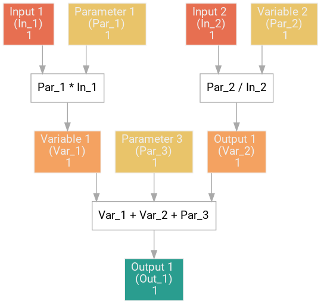

# GraphModels
A framework to compute an visualize GGGI models using computational graphs.

# Purpose

The purpose of this package is to simplify and standardize the implementation of functions used in Green Growth Institute's models. The package solves two problems. First, some contributors to models do not have the time or skills to spend time writting clean and uniform code to implement their ideas. Hence, this program acts as a template guiding collaborators. The coding skill required is minimal and allows for anyone to express their ideas meaningfully and quickly. Secondly, despite being mathematically simple, the models often involve a large number of inputs, variables and parameters with different units, sources and names. Graphs offer a simple way to vizualise and compute the models. Vizualisation is essential internally to create optimizated and logical functions. It is also essential for the credibility of the models, plotting graphs allow anyone to quickly follow and suggest improvement on the models.


# Installation

To be added on pip

# How to

The program is consise and revolves around a single object, the GraphModel. In order to build a GraphModel, the nodes are specificied in a dictionnary following a given format. This dictionnary fully defines a directed acyclic graph. The graph has two features, computation and visualisation. The GraphModel can compute the function represented by the graph for given inputs. The GraphModel can also be displayed in a "flow diagram" style.

## Nodes definitions

Each node is defined by a **dictionary** of properties. Each node must have:
- a name (a full name in english)
- an ID (a shorter name)
- a type (input, parameter, output, variable)
- a unit (to be able to track conversions and consistency across models)

Two types of nodes are possibles:

### 1. Non computational nodes (inputs or parameters):

Theses nodes are used to specify inputs and parameters. They help keeping track of what the model needs.

Here is a specification with a single node.

```python
graph_specs_0 = {
    'In_1': {'type': 'input',
             'unit': '1',
             'name': 'Input 1'}
}
```

### 2. Computational nodes (variables or outputs)

Theses nodes are used to specify variables and ouputs that needs computations. They require an additionnal "computation" property. The computation can be any python function as long as it follow a simple rule, the arguments of the function must be defined earlier in the graph and include \**kwargs.

```python
graph_specs_1 = {
    'Var_1' : {'type': 'variable',
               'name': 'Variable 1',
               'unit': '1',
               'computation': lambda Par_1, In_1, **kwargs: Par_1 * In_1
              }
}
```

## Full example

In order to quickly start building models here is an example that can be used a template.

```python
from graphmodels.graphmodel import GraphModel

graph_specifications = {
    'In_1': {'type': 'input',
             'unit': '1',
             'name': 'Input 1'},
    'Par_1': {'type': 'parameter',
              'unit': '1',
              'name': 'Parameter 1'},
    'Var_1': {'type': 'variable',
              'name': 'Variable 1',
              'unit': '1',
              'computation': lambda Par_1, In_1, **kwargs: Par_1 * In_1
              },
    'Par_3': {'type': 'parameter',
              'unit': '1',
              'name': 'Parameter 3'},
    'Out_1': {'type': 'output',
              'name': 'Output 1',
              'unit': '1',
              'computation': lambda Var_1, Var_2, Par_3, **kwargs: Var_1 + Var_2 + Par_3
              },
    'In_2': {'type': 'input',
             'unit': '1',
             'name': 'Input 2'},
    'Par_2': {'type': 'parameter',
              'unit': '1',
              'name': 'Variable 2'},
    'Var_2': {'type': 'variable',
              'name': 'Output 1',
              'unit': '1',
              'computation': lambda In_2, Par_2, **kwargs: Par_2 / In_2
             }
}

inputs_parameters = {
    'In_1': 5,
    'In_2': 4,
    'Par_1': 3,
    'Par_2': 5,
    'Par_3': 5
}

Model = GraphModel(graph_specifications)

print(Model.run(inputs_parameters))

Model.draw()
```

The output of the draw method is the following graph.




